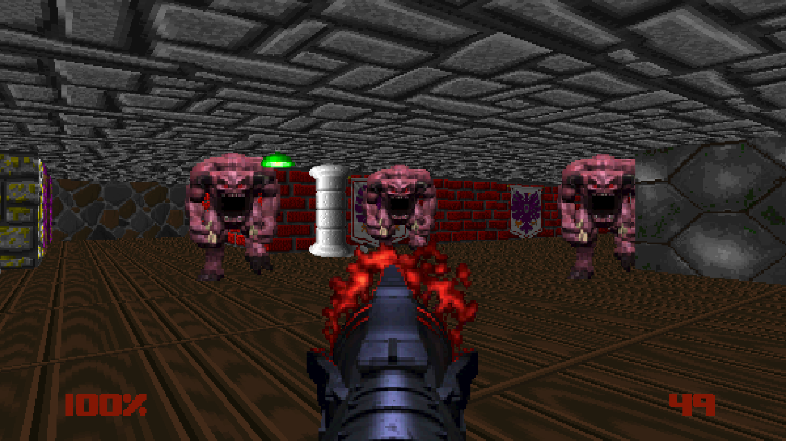
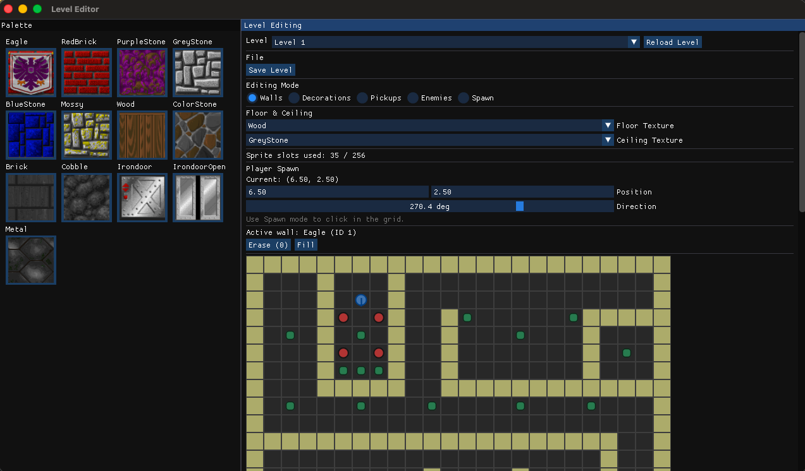
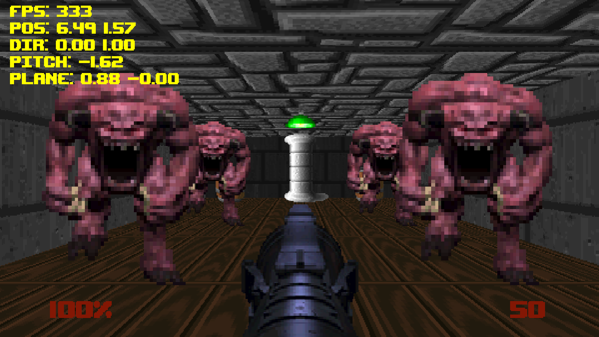
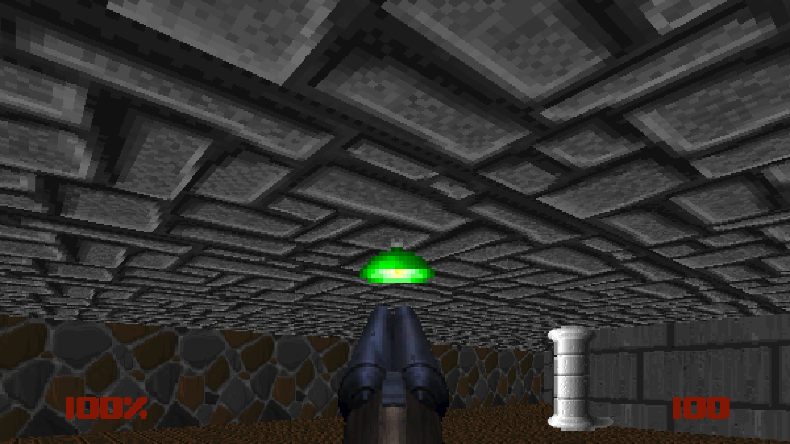

# Wolfenstein3D-style Software Renderer

**Wolfenstein3D-style software Renderer using Raycasting, written in C with SDL2.**

---

This is my **first attempt** at a software Renderer.
It’s a **heavy work in progress** with plenty of features to come.

---

## Build Instructions

### Requirements

- **SDL2** (development headers + `sdl2-config`)
- **SDL2_image**, **SDL2_ttf**, **SDL2_mixer**
- **GLEW**
- A C/C++ toolchain with CMake (used to build the bundled cimgui)

On macOS you can install the basics via Homebrew:

```bash
brew install sdl2 sdl2_image sdl2_ttf sdl2_mixer glew
```

On Ubuntu/Debian:

```bash
sudo apt install libsdl2-dev libsdl2-image-dev libsdl2-ttf-dev \
  libsdl2-mixer-dev libglew-dev build-essential cmake
```

### Building

```bash
# Build the main game
make

# Build the editor (will auto-build cimgui as a static lib on first run)
make editor
```

The resulting binaries live in `build/`:

- `build/raycast` — the game
- `build/editor` — the level editor

No additional environment variables are required; all paths are project-relative.

Subscribe to [@SeeGraphics](https://www.youtube.com/@SeeGraphics) — I’ll post there once it’s finished and make some tutorials.

---

## Screenshots

Here’s a quick visual overview of the project so far:

 

 

---

## Features (Work in Progress)

- Textured Walls & floor / ceiling
- Guns
- Sprite rendering
- HUD / DEBUG info
- Upscaling for better performance (300-500fps)
- Level Editor
- Enemies

---

## Controls

| Action            | Key / Input         |
| ----------------- | ------------------- |
| Move Forward      | W                   |
| Move Backward     | S                   |
| Strafe Left       | A                   |
| Strafe Right      | D                   |
| Turn Left / Right | Mouse or Arrow Keys |
| Fire Weapon       | Left Mouse Button   |
| Switch Weapon     | Mouse Wheel         |
| Cycle Game Mode   | G                   |
| Quit              | ESC                 |

---

## License

This project is released under the MIT License. See [LICENSE](LICENSE) for details.
