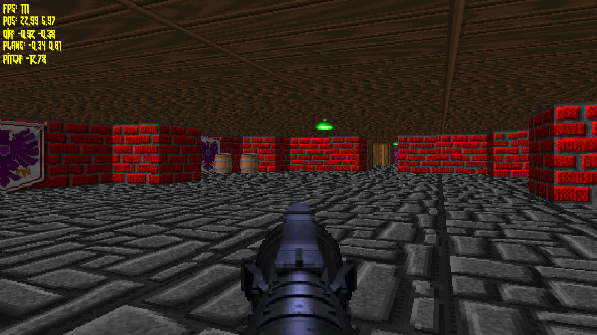
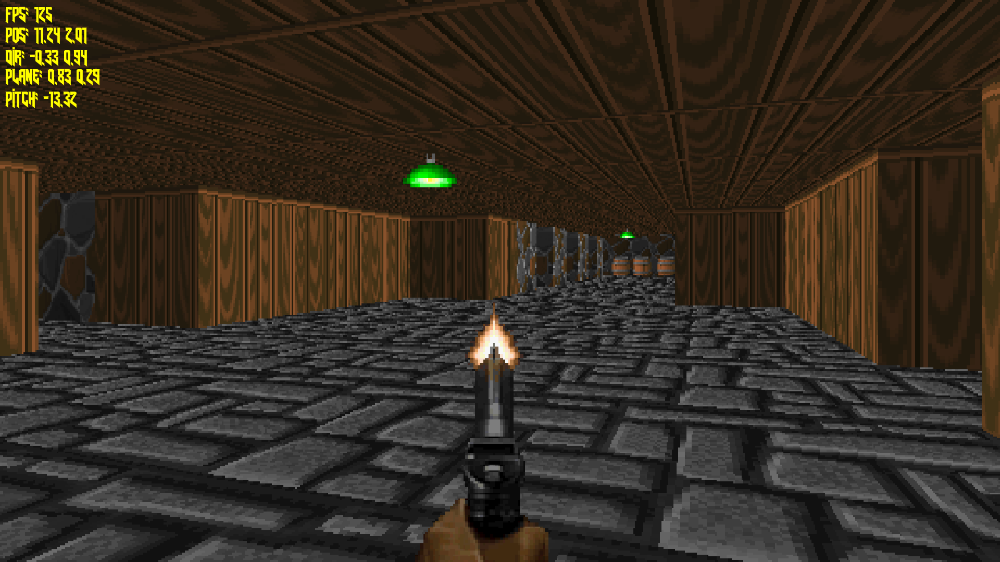
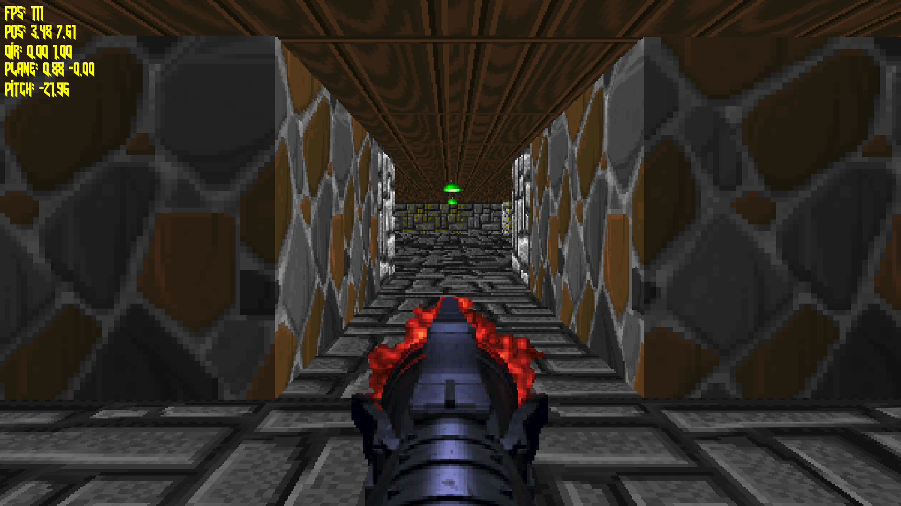
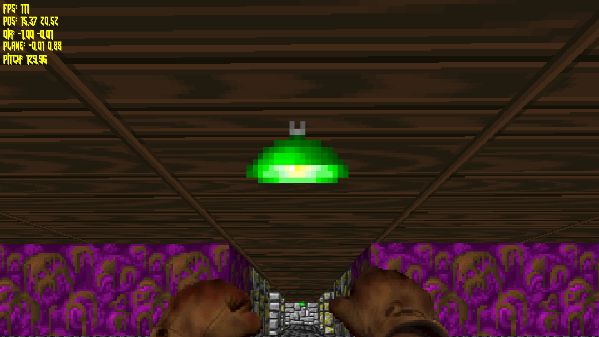

# Wolfenstein3D-style Software Renderer

**Wolfenstein3D-style software Renderer using Raycasting, written in C with SDL2.**

---

This is my **first attempt** at a software Renderer.  

So far we have:

- Basic walls and textures  
- Guns with animations and sound effects  

It performs quite well since I’m using **upscaling**.  

It’s a **heavy work in progress** with plenty of features to come, like a **level editor, enemies, etc.**

To build, you need **SDL2**, **SDL2_image**, and **SDL2_mixer**.  
I’ll improve the building process when I have the time.  

Subscribe to [@SeeGraphics](https://www.youtube.com/@SeeGraphics) — I’ll post updates there once it’s finished and make some tutorials.

---

## Screenshots

Here’s a quick visual overview of the project so far:

   

   

---

## Features (Work in Progress)

- Basic walls with textures  
- Gun animations and shooting sounds  
- Sprite rendering  
- HUD / DEBUG info
- Upscaling for better performance (300-500fps)

---

## Future Plans

- Level editor  
- Enemies and AI  
- More weapons and animations  
- Lighting and effects  
- Complete gameplay loop  

---

## Controls

| Action             | Key / Input          |
|-------------------|--------------------|
| Move Forward       | W                  |
| Move Backward      | S                  |
| Strafe Left        | A                  |
| Strafe Right       | D                  |
| Turn Left / Right  | Mouse or Arrow Keys |
| Fire Weapon        | Left Mouse Button  |
| Switch Weapon      | Mouse Wheel        |
| Cycle Game Mode    | G                |
| Quit               | ESC                |

---

## License

This project is released under the MIT License. See [LICENSE](LICENSE) for details.
