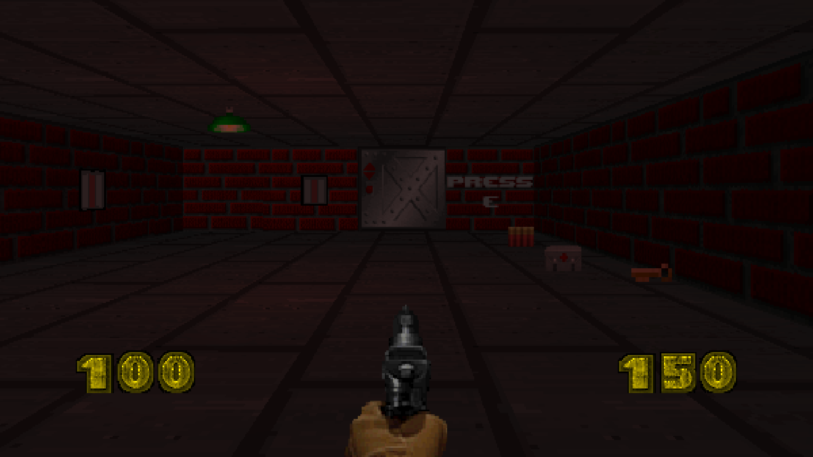
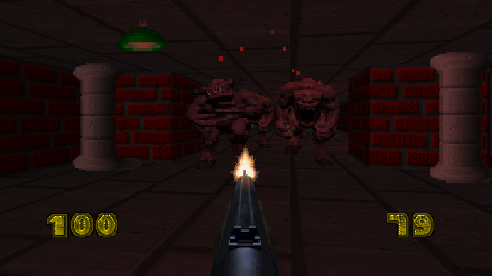
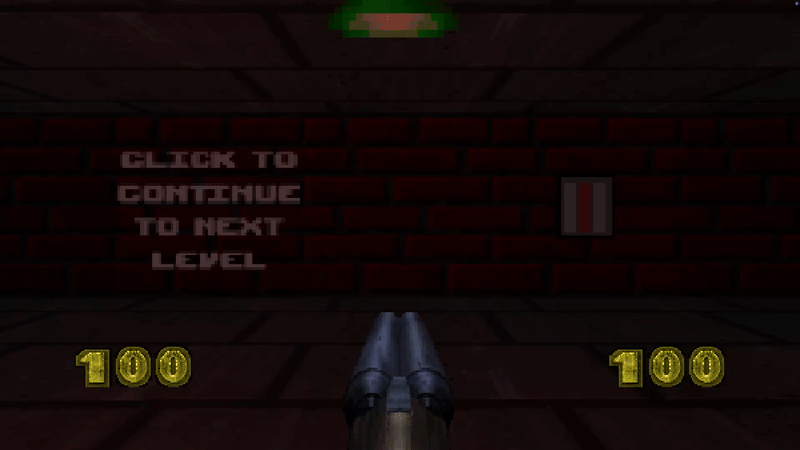
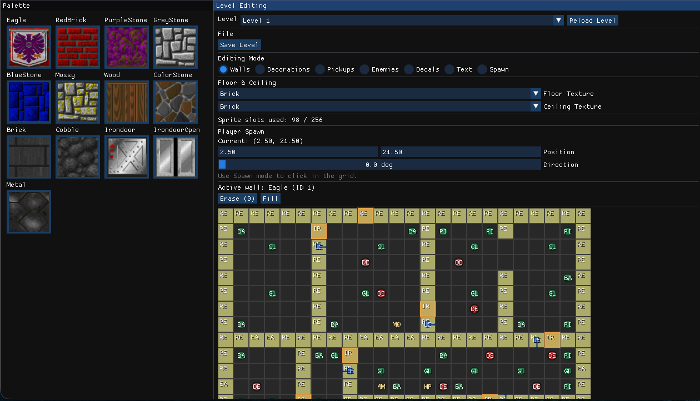

# Raycast Game Engine in C

This is my **first attempt** at a software renderer. It includes **lighting**, **quake-like** movement, **enemies**, **doors**, its own **Level Editor** and **more**. 
You can make as many levels as you like, connect them via buttons that hold the level transition attribute and then play it yourself. 
Im not sure if it runs on windows, but i'd guess so.

## Build Instructions

### Requirements

- **SDL2** (development headers + `sdl2-config`)
- **SDL2_image**, **SDL2_ttf**, **SDL2_mixer**
- **GLEW**
- A C/C++ toolchain with CMake (used to build the bundled cimgui)

On macOS you can install the basics via Homebrew:

```bash
brew install sdl2 sdl2_image sdl2_ttf sdl2_mixer glew
```

### Building

```bash
# Build the main game
make

# Build the editor (will auto-build cimgui as a static lib on first run)
make editor
```

Subscribe to [@SeeGraphics](https://www.youtube.com/@SeeGraphics) — I’ll post there once it’s finished.

---

## Screenshots

Here’s a quick visual overview of the project so far:

 

 

---

## Controls

| Action            | Key / Input         |
| ----------------- | ------------------- |
| Move Forward      | W                   |
| Move Backward     | S                   |
| Strafe Left       | A                   |
| Strafe Right      | D                   |
| Interact          | E                   |
| Turn Left / Right | Mouse or Arrow Keys |
| Fire Weapon       | Left Mouse Button   |
| Switch Weapon     | Mouse Wheel         |
| Cycle Game Mode   | G                   |
| Quit              | ESC                 |

---

## License

This project is released under the MIT License. See [LICENSE](LICENSE) for details.
